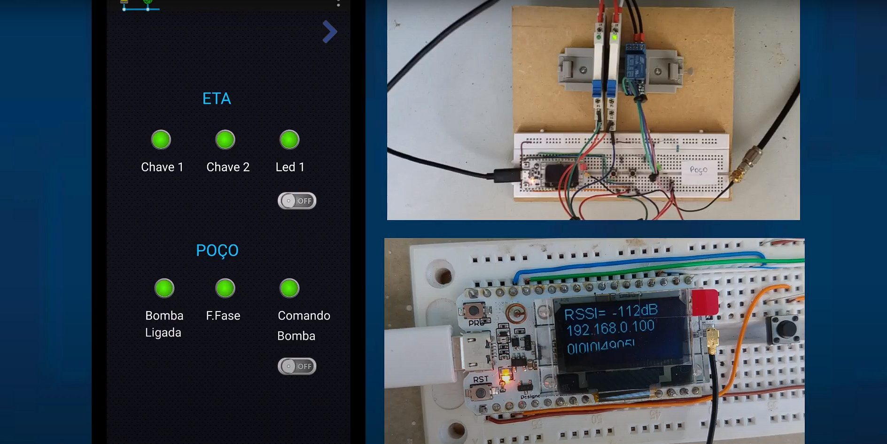
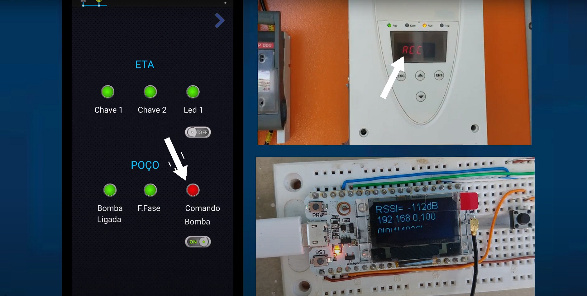

ControleQuadroEletrico_ESP32_LoRaWAN_Modbus-TCP_OLED

Projeto desenvolvido com uma dupla de placas 'Esp32 V2 Lora Display Oled Wifi 915mhz Heltec Ble com Antena'.
Esta placa possui integrado tecnologia de rádio Lora, Wifi e Bluetooth.

Uma das placas foi instalada no quadro elétrico de um poço de captação de água, fazendo leitura de alguns estados digitais do poço. Em série com o comando da softstarter, foi instalado um relé que podia ser controlado pela saída digital do ESP32 para ligar/desligar o poço.

A 1.5 km de distância estava a outra placa, mesmo com obstáculos como casas e árvores, o link de rádio foi estabelecido, e a comunicação entre as duas placas via LoraWAN, recebendo e enviando pacotes.

Os dados do LoraWAN, por sua vez, eram salvos em registradores do protocolo Modbus TCP, que podiam ser lidos/comandados via Wi-Fi pelo software Scada Virtuino, um master na rede Modbus TCP.  

